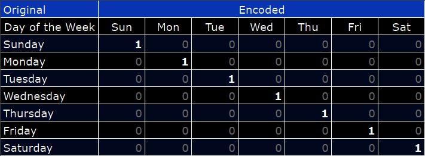
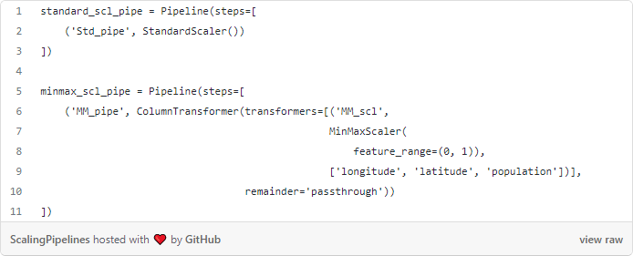
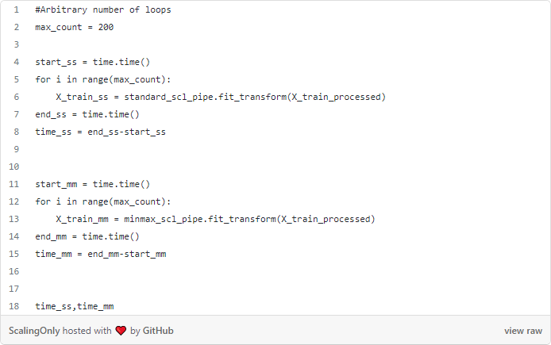
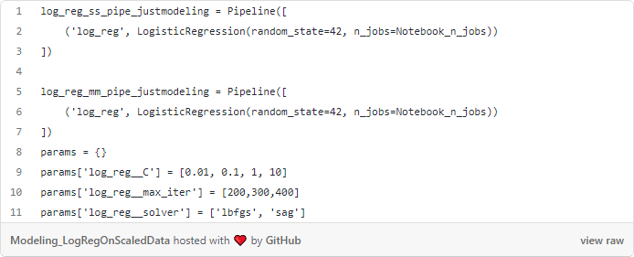
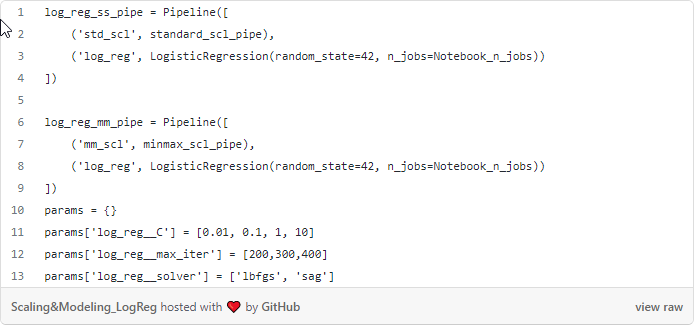
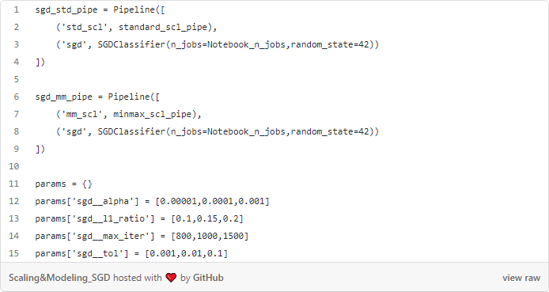
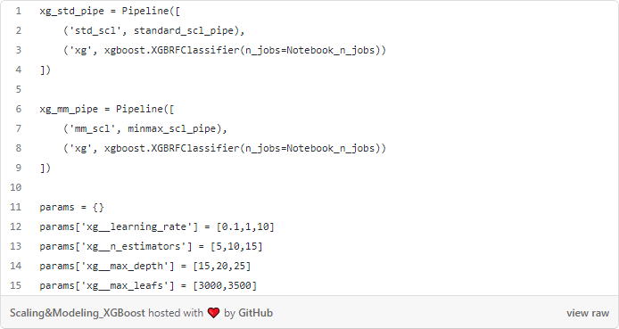
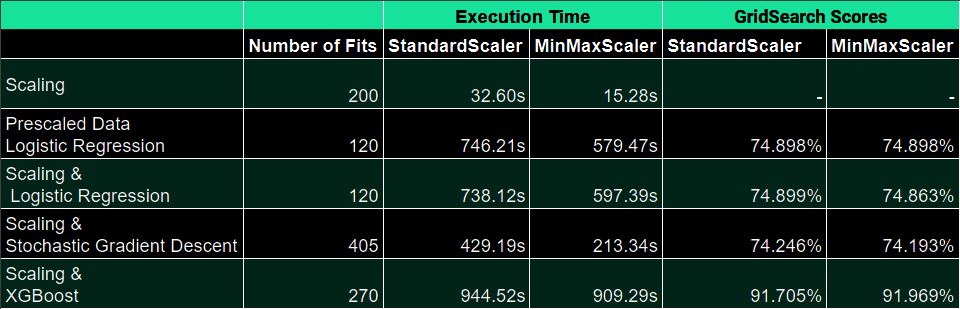

# Scaling Mixed Datasets
## Comparing StandardScaler and MinMaxScaler on mixed datasets

### Author:

- Saad Saeed: 
[LinkedIn](https://www.linkedin.com/in/saadsaeed85/) |
[GitHub](https://github.com/ssaeed85) |
[Email](mailto:saadsaeed85@gmail.com)

Should you standard scale all your columns or just min max scale your numericals in your modeling pipelines?

When collating data to create a predictive model, data scientists often have to scale their dataset so that no particular column has an oversized impact on the final model. If the entire dataset were entirely numerical (discreet or continuous) the preferred tool in sklearn is StandardScaler, which scales each column such that the mean is 0 and standard deviation is 1. This effectively puts each column on a level playing field. However, what if a significant portion of the dataset is binary? Perhaps a result from OneHotEncoding?

>An example of One-Hot-Encoding on a categorical column

Now we have 2 options available to use:
Use StandardScaler across the entire dataset, including the binary columns
Use MinMaxScaler, only on the numerical columns, scaled between 0, 1

Keeping the binary values as binary allows us to have some level of interpretability in our final dataset which is a distinct advantage, however, as part of this blog we will be focusing on the runtime computational differences between the 2 methods. 
I used the data set provided as part of the Tanzanian water well competition here. This gives us a a comprehensive dataset of both categorical and numerical data. The resulting dataframe prior to scaling has 57,500 entries with 250 One Hot Encoded columns and 3 numerical columns.

For the purpose of these tests, I:

- used Jupyter magic command %time was used to track computation time
- measured the time for scaling the data
- measured the time for modeling on pre-scaled data (logistic regression)
- measured the time for scaling and modeling for a few different algorithms
- employed GridSearchCV using identical parameters to run models on both standard scaling and min max scaling pipelines
- kept number of core usage, n_jobs, constant throughout the test. Note: this only applies to GridSearchCV

## Scaling Pipelines
Pipelines were employed as part of the testing procedure to minimise overall implementation differences

>Note that longitude, latitude and population are numerical columnsTests

## Using only Scaling Pipelines
In this test we use the above scaling pipelines to scale the OneHotEncoded dataset to our 'processed' dataset

> Total fits: 200

## Logistic Regression on Pre-scaled Data
In this test we use a basic logistic regression pipeline to model on the data we created in the previous test (the 'processed' dataset)

> Total GridSearchCV fitst: 120

## Scaling and Logistic Regression
In this test we employ both scaling and logistic regression as part of the same pipeline. The same scaling pipelines we used in the first test are used.

> Total GridSearchCV fits: 120

## Scaling and Stochastic Gradient Descent
In this test we employ both scaling and Stochastic Gradient Descent as part of the same pipeline. The same scaling pipelines we used in the first test are used.

> Total GridSearchCV fits: 405

## Scaling and XGBoost
In this test we employ both scaling and XGBoost as part of the same pipeline. The same scaling pipelines we used in the first test are used.

> Total GridSearchCV fits: 270

# Results

>Note: that this shouldn't necessarily be taken as 1 model performing better than the other. Although the parameters were chosen at random, for any given combination of parameters, convergence may not occur for a given dataset. Although scores are displayed, it is to be taken with a grain of salt.

# Conclusions

- For the same set of parameters, the overall GridSearchCV scores stay about the same for all 3 modeling techniques used.
- Logistic Regression and SGD seem to make the biggest improvements when using the MinMaxScaling method with SGD almost halving its computation times.
- Computation time for XGBoost between using the two scalers seem fairly equivalent. This would make sense considering the underlying model is DecisionTreeClassifier, a modeling technique that doesn't need scaled datasets.

# Next Steps
- Incorporate more models
- Increase the number of fits
- Track not only the overall score, but also the precision, recall, f1-score